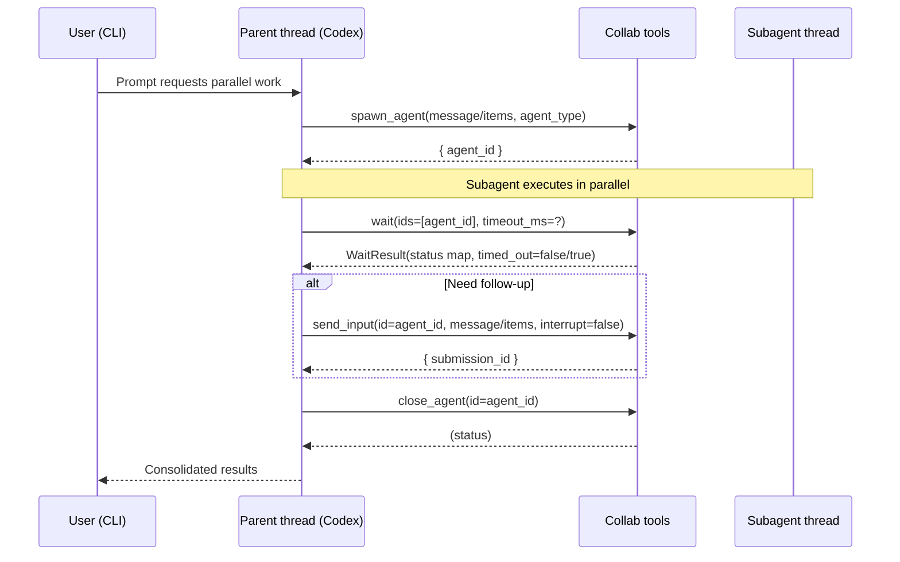

# Codex CLI Subagents

## Executive Summary

Codex multi-agent “subagents” are an **experimental** capability in the Codex CLI that lets a primary Codex thread **spawn multiple specialized agent threads in parallel**, coordinate them, and then **return a consolidated result**. This is primarily aimed at **fan-out/fan-in workflows** such as repository exploration, multi-aspect PR review, or parallel subtask execution.

From the Codex CLI’s public documentation and open-source implementation, “subagents” are best understood as:

- **Additional Codex agent threads** spawned *within the same Codex runtime*, governed by sandbox/approval policy rules, and orchestrated through collaboration tools.  
- **Configurable “agent roles”** (e.g., `explorer`, `reviewer`) defined via `config.toml` to select different models, instructions, and sandbox policies per spawned subagent.  
- A **tool-call interface** exposed to the underlying model when enabled: `spawn_agent`, `send_input`, `resume_agent`, `wait`, and `close_agent`. Their parameter schemas are defined in the Codex CLI codebase and constrained with explicit JSON-schema-like shapes. 

Several details the prompt requested—such as **packaged “subagent plugins”**, **lifecycle hooks you can implement**, or **gRPC-based invocation**—are **not publicly documented** for Codex CLI subagents as of 2026-02-20; where the open-source code provides partial insight, this report cites it, and otherwise marks items as **not publicly documented**.

## Scope and Terminology

### What “Subagents” means in Codex CLI

In Codex CLI documentation, “sub-agents” refers to **spawned, parallel agent threads** used in **multi-agent workflows**. Codex orchestrates these threads: it can spawn them, route follow-up instructions, wait for them, and close them, then produce a consolidated response.

Subagents are **not** described publicly as user-authored binaries, plugins, or standalone services. Instead, “authoring subagents” in Codex CLI is mainly:

- **Defining agent roles** in TOML (`[agents.<name>]`, `agents.max_threads`) and optional role-specific config layers (`agents.<name>.config_file`).  
- **Enabling** the multi-agent feature (`[features].multi_agent = true`) so the collaboration tools become available.

### Relationship to other Codex extensibility surfaces

It is easy to confuse subagents with other Codex extension mechanisms:

- **Skills**: directory-packaged workflows (`SKILL.md`, optional scripts, metadata) that Codex can invoke explicitly or implicitly. Skills provide “capabilities,” but are not “subagents” themselves.   
- **MCP servers**: external tools exposed via MCP; Codex can call them, and Codex itself can run as an MCP server (`codex mcp-server`) for orchestration by other agent systems.   
- **App Server**: a JSON-RPC protocol (`codex app-server`) that exposes threads, turns, approvals, and streaming events to build rich clients. 

This report focuses on **Codex CLI multi-agent subagents** (spawned agent threads and their role configuration), and only pulls in Skills/MCP/App Server where they impact orchestration, observability, or interoperability.

## Architecture and Invocation Model

### High-level architecture

Official OpenAI documentation describes the “Codex harness” as a runtime that manages Codex agent threads and exposes them through stable integration surfaces such as the App Server. The App Server is implemented as a long-lived process that hosts Codex core “threads,” translating client requests into core operations and streaming events back to the client. 

Within this mental model:

- A **subagent** is effectively **a second (or Nth) Codex thread** spawned and managed by the thread manager / agent control component.   
- Multi-agent orchestration uses **collaboration tool calls** (`spawn_agent`, `send_input`, `resume_agent`, `wait`, `close_agent`) when the `multi_agent` feature is enabled.   
- Subagents inherit sandbox policy and run with **non-interactive approvals** (details in the next sections).

### Invocation flow in the interactive CLI

The Codex docs articulate the user-visible flow:

- Enable multi-agent.
- Codex decides when to spawn subagents (or you explicitly request it).
- You can switch between active threads using `/agent`.
- Codex waits for all requested results and consolidates them.

A concrete sequence, based on the public tool schemas and orchestration behavior, looks like:



Tool availability is gated by `features.multi_agent` and the collaboration tools are explicitly named in the configuration reference. 

### IPC mechanisms: what is used vs. not used

For **subagents inside the CLI**, the public model is **not** “spawn a process and talk over IPC.” Subagents are orchestrated as **threads within Codex’s runtime**, with coordination through the internal tool-call interface and event stream.

Where IPC *does* appear in the Codex ecosystem is mainly in **integration surfaces**:

- **`codex exec`**: progress streams to `stderr`; final answer to `stdout`; optional JSONL event stream via `--json`.   
- **App Server** (`codex app-server`): JSON-RPC over **stdio JSONL** (default) or **WebSocket frames** (experimental/unsupported).   
- **MCP Server** (`codex mcp-server`): Codex runs as an MCP server over stdio for consumption by other MCP clients. turn

**gRPC for subagent invocation** is **not publicly documented** for Codex CLI subagents. (The config reference does mention OTLP gRPC as an OpenTelemetry exporter option, but that is observability transport, not subagent invocation.)

## Authoring Subagents

“Authoring” in Codex CLI subagents primarily means **defining agent roles** (configuration-layer authoring) and understanding the **collaboration tool APIs** that the system uses when multi-agent is enabled.

### Step-by-step: define agent roles

Codex CLI supports a dedicated `[agents]` section, where each role can define:

- `description` (role guidance used by Codex when deciding/spawning)
- `config_file` (path to a TOML layer applied to the spawned agent of that role)
- global concurrency constraint: `agents.max_threads`

Codex ships with built-in roles such as `default`, `worker`, and `explorer`, and user-defined roles can override built-ins by name.

Example directory layout (typical):

```text
~/.codex/
  config.toml
  agents/
    reviewer.toml
    custom-explorer.toml
```

The multi-agent docs include the concrete example below (reproduced as code; adapt paths as needed).

```toml
# ~/.codex/config.toml

[agents.default]
description = "General-purpose helper."

[agents.reviewer]
description = "Find security, correctness, and test risks in code."
config_file = "agents/reviewer.toml"

[agents.explorer]
description = "Fast codebase explorer for read-heavy tasks."
config_file = "agents/custom-explorer.toml"
```

Role-specific config layering files are normal TOML config layers. For example:

```toml
# ~/.codex/agents/reviewer.toml

model = "gpt-5.3-codex"
model_reasoning_effort = "high"
developer_instructions = """
Focus on high priority issues, write tests to validate hypothesis before flagging an issue.
When finding security issues give concrete steps on how to reproduce the vulnerability.
"""
```

```toml
# ~/.codex/agents/custom-explorer.toml

model = "gpt-5.3-codex-spark"
model_reasoning_effort = "medium"
sandbox_mode = "read-only"
```

These examples are explicitly shown in the official multi-agent documentation.

### Agent role schema and constraints

The role schema is explicitly documented:

- `agents.max_threads`: maximum number of concurrently open agent threads.
- `[agents.<name>]`: declares a role (used as `agent_type` when spawning).
- `agents.<name>.description`: guidance string.
- `agents.<name>.config_file`: TOML config layer.

Notes include: unknown fields rejected; relative `config_file` paths resolved relative to the declaring `config.toml`; and failure to load a role config file can cause spawns to fail.

### Collaboration tools API: exact parameter schemas

When `features.multi_agent` is enabled, Codex exposes multi-agent collaboration tools. The config reference names them, and the open-source tool spec defines their parameter schemas and semantics. 

The relevant tools and key parameters (from the Codex CLI open-source spec) are:

- `spawn_agent`
  - `message` (optional string): initial plain-text task
  - `items` (optional structured array): typed items (text, image, local_image, skill, mention)
  - `agent_type` (optional string): role name
  - You must provide either `message` or `items` (open-source handler tests enforce exclusivity).   

- `send_input`
  - `id` (required string): agent id (from `spawn_agent`)
  - `message` or `items` (optional)
  - `interrupt` (optional boolean; default false): when true, stop current task and handle immediately; else queue.   

- `resume_agent`
  - `id` (required string): previously closed agent id to resume.   

- `wait`
  - `ids` (required array of strings): one or multiple agent ids; description states passing multiple waits for whichever finishes first
  - `timeout_ms` (optional number): defaults, min, max are enforced in code to prevent busy polling.   

- `close_agent`
  - `id` (required string): agent id to close; “return its last known status.”   

The schemas (including required fields) are defined in `codex-rs/core/src/tools/spec.rs`.

### Return types and status model

The tool spec describes some return semantics in natural language, but the open-source handler code clarifies JSON outputs for several calls:

- `spawn_agent` returns JSON containing an `agent_id`.  
- `send_input` returns JSON containing a `submission_id`.  
- `resume_agent` returns JSON including a `status` field.  
- `wait` returns JSON containing:
  - `status`: a map of agent/thread ids to `AgentStatus`
  - `timed_out`: boolean (true when no statuses returned before deadline)

The precise full sum-type definition of `AgentStatus` is **not publicly documented** as a stable API surface; however, the open-source code indicates at least these states are used:

- `PendingInit` and `Running` are treated as **non-final**
- `Completed(last_agent_message)` exists as a completion variant
- `Errored(message)` exists for failure paths
- `Shutdown` exists
- `NotFound` is used when an agent/thread id is missing 

If you need the exact full enum for robust client-side parsing, the most reliable method is to inspect the **`codex_protocol`** crate source in the `openai/codex` repository (not exposed as a stable, separately versioned “subagents API” in the public docs). 

### Lifecycle rules and guardrails

From the multi-agent docs and open-source implementation:

- Subagents **inherit** the parent sandbox policy, but run with **non-interactive approvals**; if a subagent attempts an action requiring a new approval, the action fails and the error surfaces to the parent workflow.  
- The handler clamps `wait.timeout_ms` to discourage busy polling loops and reduce CPU burn:
  - minimum 10 seconds
  - default 30 seconds
  - maximum 5 minutes   
- Codex enforces a **max-depth guardrail** for spawning to avoid unbounded recursive fan-out; when the depth limit is reached, `spawn_agent` fails with a “depth limit reached, solve yourself” style error. The changelog also calls out “max-depth guardrails.”   
- The Codex changelog records that the **maximum allowed number of sub-agents was reduced to 6** (fan-out limit) to tighten resource usage and guardrails.

## Configuration, Deployment, and Runtime Controls

### Enabling multi-agent subagents

The multi-agent feature is explicitly “experimental” and must be enabled:

- Via `/experimental` in the CLI (toggle, then restart).  
- Via configuration: set `[features].multi_agent = true`.  

The configuration reference states `features.multi_agent` enables the collaboration tools `spawn_agent`, `send_input`, `resume_agent`, `wait`, `close_agent`.

### CLI flags and operational commands relevant to subagent workflows

Codex CLI has a wide CLI surface; the following are most directly relevant when you’re building repeatable subagent-heavy workflows and want deterministic behavior.

| Category | Option / command | Purpose | Notes |
|---|---|---|---|
| Non-interactive orchestration | `codex exec "PROMPT"` | Run Codex without TUI; good for pipelines | Streams progress to `stderr` and final message to `stdout`  |
| Machine-readable telemetry | `codex exec --json "PROMPT"` | Emit JSONL event stream | Event types include `thread.started`, `turn.*`, `item.*`, `error`  |
| Resume pipeline stage | `codex exec resume --last "PROMPT"` | Continue prior exec session | Documented in non-interactive mode guide  |
| Safety / permissions | `--sandbox {read-only|workspace-write|danger-full-access}` | Set sandbox policy | Works across interactive and exec modes turn |
| Automation preset | `--full-auto` | Preset for automation | Described as workspace-write + on-request approvals  |
| Disable approvals/sandbox | `--yolo` | Bypass approvals and sandbox | Explicitly described as dangerous  |
| Persist final answer | `--output-last-message <path>` | Write final assistant message to file | Useful for chaining steps  |
| Auth (interactive + general) | `codex login --with-api-key` | Read API key from stdin | CLI reference documents stdin-based flag  |
| Auth check | `codex login status` | Exit 0 if credentials present | Designed for scripting  |

Sources: Codex CLI command reference and non-interactive mode guide. turn

### Configuration layering, “deployment,” and versioning

In Codex CLI, “deploying” subagent roles typically means shipping the relevant TOML and instruction files through known config search paths:

- User-level: `~/.codex/config.toml` (default home)
- Project-level: `.codex/config.toml` (only loaded for trusted projects)
- System-level: `/etc/codex/config.toml` (Unix) 

Codex configuration precedence (high to low) includes: CLI flags and `--config` overrides, then profile values, then project configs, then user config, then system config, then built-in defaults.

**Versioning** is tightly tied to the CLI build: the Codex changelog is published per release (e.g., Codex CLI `0.94.0`, and later releases).  The developer changelog also enumerates current releases (e.g., “Codex CLI 0.104.0” was published on 2026-02-18). 

Install/upgrade is officially documented via npm (`@openai/codex`) and Homebrew. 

### Environment variables and authentication patterns

Key environment variables documented for Codex workflows include:

- `CODEX_HOME`: sets Codex’s local state directory (defaults to `~/.codex`). It influences config and state files, and also the global `AGENTS.md` discovery root.   
- `CODEX_API_KEY`: supported **only in `codex exec`**, to provide credentials in CI for a single run.  
- `OPENAI_BASE_URL`: for pointing the built-in OpenAI provider at a proxy/router without editing config.  
- WebSocket proxy variables `WS_PROXY` / `WSS_PROXY`: added recently (2026-02-18) for websocket proxying in the Codex network proxy.

For authentication, the CLI supports ChatGPT OAuth, device auth, or API keys; `codex login` exists as the explicit authentication command, and the CLI reference documents `--with-api-key` (stdin). turn  
The authentication guide documents fallback strategies such as copying `~/.codex/auth.json` to a headless machine and treating it like a password.

### Permissions, sandboxing, and secret exposure controls

Subagents and their orchestration are closely tied to sandbox rules:

- `sandbox_mode`: `read-only`, `workspace-write`, `danger-full-access`. turn  
- `sandbox_workspace_write.network_access`: allows outbound network access in workspace-write mode.  
- `approval_policy`: controls approvals for command execution, with documented values `untrusted`, `on-request`, `never`.  
- Subagent spawns apply a guardrail: spawned agents run with approvals set to “never” (non-interactive approvals), matching the user-facing docs that approvals cannot be requested mid-subagent.  
- `shell_environment_policy.*`: controls which environment variables are inherited or stripped when spawning subprocesses, which is a key mitigation for secret leakage into tool execution.

### “Manifest files” and packaging: what exists vs. what does not

For **subagent roles**, there is no publicly documented “subagent manifest format.” Roles are configured via `config.toml` fields (`agents.<name>.description`, `agents.<name>.config_file`).

If your goal is packaging reusable automation artifacts alongside or for subagent-driven workflows, Codex **Skills** do provide a manifest-like structure:

- A skill is a directory with `SKILL.md` containing front-matter fields `name` and `description`, plus optional `scripts/`, `references/`, `assets/`, and optional `agents/openai.yaml`.

Skill packaging fields (as documented):

| Skill artifact | Location | Purpose |
|---|---|---|
| Required metadata + instructions | `SKILL.md` front matter (`name`, `description`) | Trigger matching + workflow guidance  |
| Optional executable code | `scripts/` | Run code as part of the skill (shell, Python, Node, etc.)  |
| Optional docs | `references/` | Supporting documentation  |
| Optional assets/templates | `assets/` | Reusable scaffolds or templates  |
| Optional metadata | `agents/openai.yaml` | Appearance/dependencies (documented as optional)  |

If you specifically require “subagent manifests” as a formal, versioned API surface (e.g., for external orchestration or distribution), that is **not publicly documented** for Codex CLI subagents; the most direct way to obtain it is to inspect the evolving `openai/codex` source or discuss in the project’s issue tracker. 

## Observability, Debugging, and Testing

### Logging and local diagnostics

Codex writes logs to a directory controlled by `log_dir`, defaulting to `$CODEX_HOME/log`, and examples mention files such as `codex-tui.log`.   
The `AGENTS.md` guide explicitly points to `~/.codex/log/codex-tui.log` as a place to audit instruction sources after a session.

### JSON event streams for automation and debugging

For non-interactive runs, `codex exec` supports a JSONL event stream via `--json`. The docs state:

- With `--json`, `stdout` becomes JSONL
- Event types include `thread.started`, `turn.started`, `turn.completed`, `turn.failed`, `item.*`, and `error`
- Item types include agent messages, reasoning, command executions, file changes, MCP tool calls, web searches, and plan updates 

This is the most stable and script-friendly “observability” surface for subagent-heavy automation, because it lets you correlate multi-agent activity with a structured timeline. 

### OpenTelemetry support

Codex exposes OpenTelemetry configuration keys:

- `otel.exporter` and `otel.trace_exporter` support `otlp-http` or `otlp-grpc`, endpoints, headers, and TLS materials.
- `otel.log_user_prompt` allows exporting raw user prompts (explicit opt-in).

This is critical if you want to trace subagent fan-out workloads and correlate them with infrastructure metrics (network proxying, provider retries, etc.). turn

### App Server: event-driven observability and error taxonomy

If you are building a client or instrumenting multi-thread behaviors at scale, the App Server documentation is explicit:

- Transports: stdio JSONL (default) or websocket frames (experimental/unsupported)
- When overloaded, server rejects with JSON-RPC error code `-32001` “Server overloaded; retry later,” and recommends exponential backoff with jitter. turn  
- Event stream: `thread/*`, `turn/*`, `item/*` notifications; each turn starts with `turn/started` and ends with `turn/completed`; errors include typed variants like `ResponseStreamDisconnected`, `Unauthorized`, `SandboxError`, etc.   
- Approval flows are modeled as server-initiated JSON-RPC requests (e.g., `item/commandExecution/requestApproval`).

### Testing and local reproduction strategies

The open-source multi-agent tool handler includes integration-style tests demonstrating:

- `spawn_agent` rejects empty messages
- `spawn_agent` rejects providing both `message` and `items`
- `send_input` accepts structured items including “mentions”
- `wait` rejects non-positive timeouts and empty id lists 

For practitioners, the most pragmatic debugging loop is:

1. Reproduce in a contained repo with multi-agent enabled.
2. Run `codex exec --json` to capture structured evidence of tool calls and failures.
3. Correlate with log files in `$CODEX_HOME/log`. 

## Interoperability, Migration, Limitations, and Troubleshooting

### Interoperability with SDKs and other Codex components

#### Codex CLI subagents vs Codex SDK

The Codex SDK is positioned as the programmatic control surface for local Codex agents (“control it programmatically,” “CI/CD,” “internal tools”).   
Codex CLI subagents, by contrast, are a **within-session orchestration capability** driven by the CLI runtime with role configuration and tool calls, not a separate SDK API.

A key practical difference: in the CLI subagent model, the “subagent API” is not a stable public library interface; it is an internal tool-call system gated by `features.multi_agent`. 

#### Codex CLI subagents vs OpenAI Agents SDK

The “Use Codex with the Agents SDK” guide describes a different multi-agent pattern: running Codex as an MCP server (`codex mcp-server`) and orchestrating it from the Agents SDK, where Codex becomes a tool (`codex` and `codex-reply`) inside a larger agent workflow. 

In other words:

- CLI subagents: spawn **Codex threads** and coordinate them within Codex.
- Agents SDK orchestration: coordinate multiple higher-level agents (handoffs, traces), with Codex as one callable capability via MCP. 

#### App Server as the primary “rich client” integration

OpenAI’s App Server materials state the App Server is the interface Codex uses to power rich clients and can generate TypeScript/JSON Schema definitions pinned to the CLI version. turn  
This matters because, if you want to build robust tooling around subagent-heavy workflows, **App Server event streams** are a more explicit and structured protocol surface than trying to scrape terminal UI output. 

### Migration guidance from older subagent models

The Codex changelog indicates a naming and configuration migration:

- “collab” naming has been migrating to “multi-agent”
- specifically, the **collab feature flag key was renamed to `multi_agent`** and “collab modules” were renamed to “multi agents”   
- release notes mention “migration toward the new multi-agent naming/config surface” and customizable multi-agent roles via config. 

If you have older automation using `--enable collab` or older config keys, the safest migration approach is:

1. Move to `[features].multi_agent = true` and verify collaboration tool availability via behavior.
2. Revalidate any parsing logic against the current JSONL event model (`codex exec --json`) since event mapping has been evolving. 

### Known limitations

A few limitations are explicitly documented in official release notes and docs:

- **Subagent fan-out cap**: maximum allowed number of sub-agents reduced to **6** for resource/guardrail reasons (Codex CLI 0.91.0 changelog).  
- **Experimental status**: Multi-agent is experimental and must be enabled; visibility in other surfaces beyond the CLI is described as “coming soon.”  
- **Non-interactive approvals for subagents**: subagents cannot pause for approvals; actions requiring additional approval fail and surface error to the parent.  
- **Wait timeout clamping**: minimum 10s, default 30s, maximum 5 minutes to prevent busy polling loops and high CPU usage. 

Items like “memory limits per subagent,” “explicit CPU quotas,” or “subagent sandbox namespaces” are **not publicly documented** as user-configurable knobs for Codex CLI subagents. (The closest public knobs relate to sandbox policy, token limits, and history/compaction policies.) 

### Troubleshooting playbook

#### Subagent action fails due to approvals/sandbox

Symptom: subagent attempts a command or write that requires a new approval; action fails.

What to do:

- Move the relevant work into the parent thread (which can request approval), or
- Create a role-specific config with a more permissive sandbox mode if appropriate (e.g., `workspace-write`), and spawn that role for tasks needing writes.

#### `wait` returns no status / appears to stall

Remember:

- `wait` clamps `timeout_ms` and sets a minimum 10 seconds; very short timeouts are rejected or clamped to discourage poll loops.   
- The `wait` result sets `timed_out: true` when it does not receive a final status by the deadline.

Operational suggestions:

- Prefer **minutes-scale waits** rather than tight loops; or use a single `wait` with longer `timeout_ms` rather than repeated polling.   
- Use `codex exec --json` to see whether the subagent threads are making progress (`item.*` events).

#### `spawn_agent` fails with “not found” or spawns fail under system pressure

A recent open issue documents failures to spawn subagents when system resources (e.g., inotify watchers) are exhausted, and notes the error surfaced to the model may be opaque (“not found”). 

Practical mitigations (bounded to what’s documented and observable):

- Check `$CODEX_HOME/log` for underlying runtime errors.   
- Reduce concurrent subagent usage to stay within caps (max 6) and close agents when done.   
- If you hit OS file watcher limits, address system resource settings outside Codex (this is an OS-level issue referenced by maintainers and logs, not a Codex configuration key).

#### Inconsistent flags across docs

One example: the CLI reference documents `codex login --with-api-key` (stdin), while some older snippets show alternative flag spellings. For automation and reliability, prefer the **CLI reference** as the “source of truth” for supported flags. 