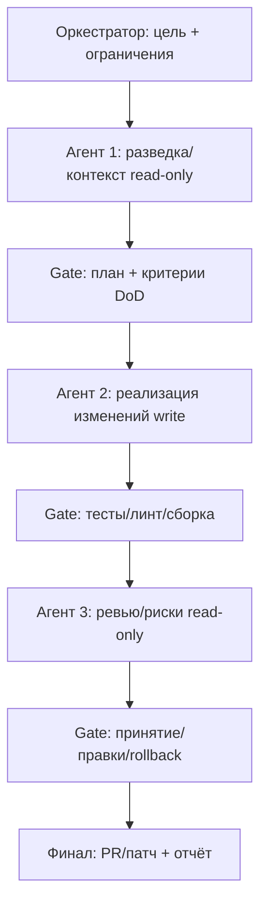
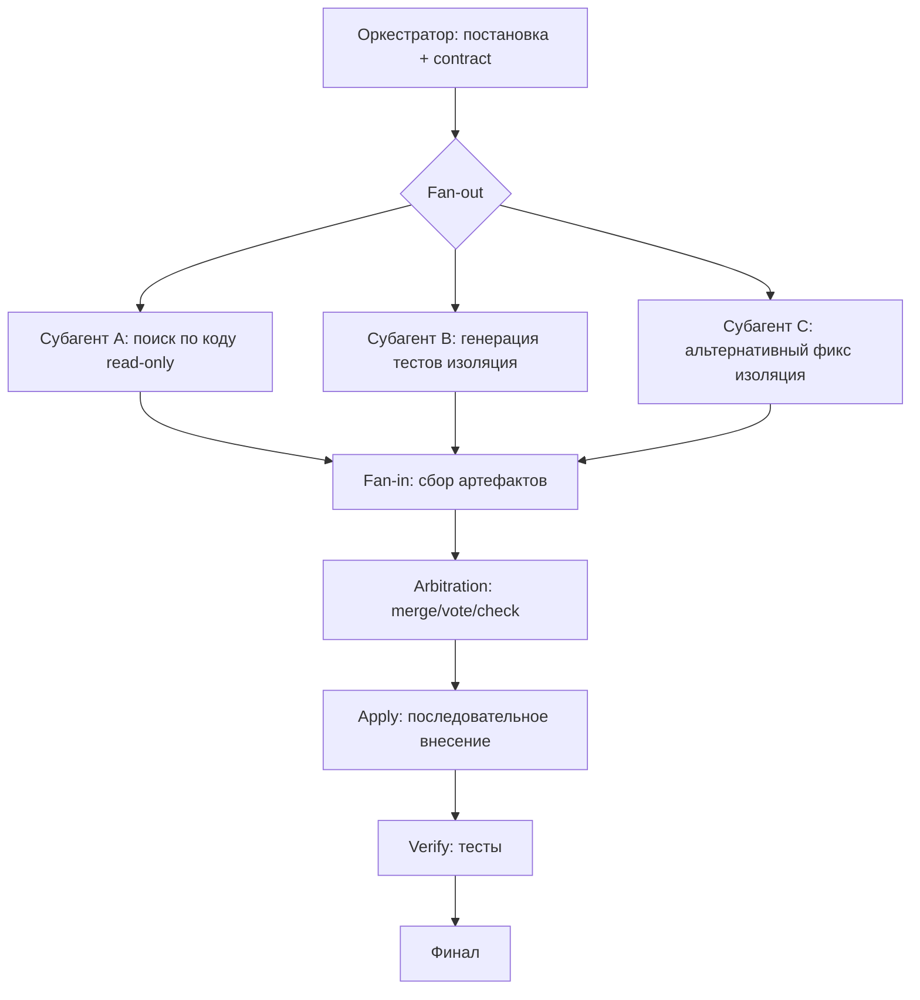
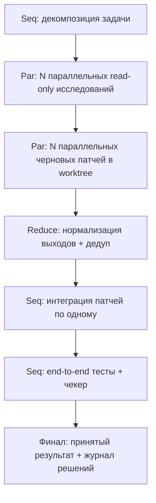

# Оркестрация мультиагентных систем в CLI-среде

Объединённое исследование паттернов sequential, parallel и hybrid оркестрации для мультиагентных CLI-систем (Codex CLI, Claude Code, OpenCode CLI).

---

## 1. Обзор

Мультиагентная оркестрация — архитектурный паттерн, при котором несколько специализированных LLM-агентов координируются для решения задач, превышающих возможности одного агента. Два фундаментальных паттерна — **sequential** (последовательный пайплайн) и **parallel** (параллельный fan-out/fan-in) — определяют латентность, надёжность и качество результата системы.

В CLI-инструментах оркестратором выступает центральный агент (main session), который делегирует подзадачи субагентам через механизм Task/subagent. Свойства среды напрямую влияют на безопасность параллелизма и форму delegation contract:

- **Codex CLI** — агент работает локально в выбранной директории, читает/меняет файлы, запускает команды. Субагенты объявляются через `[agents.*]` в `config.toml`.
- **Claude Code** — субагенты имеют отдельное контекстное окно, собственные ограничения инструментов и независимые permissions. Поддерживается изоляция через временный git worktree.
- **OpenCode CLI** — режим multi-session (несколько параллельных сессий/агентов на одном проекте), система permissions на уровне инструментов (allow/deny/ask).

---

## 2. Sequential Workflow

### Суть паттерна

Sequential orchestration выстраивает агентов в детерминированную линейную цепочку: каждый агент обрабатывает выход предыдущего, формируя пайплайн прогрессивной трансформации. Маршрутизация предопределена — ни один агент в цепочке не принимает решение о следующем шаге самостоятельно. Общее состояние накапливается и передаётся вдоль пайплайна.

### Когда использовать

- **Сильные зависимости данных.** Выполнить шаг N без результата шага N-1 либо невозможно, либо порождает лавинообразный рост неопределённости. Примеры: спецификация -> проектирование -> реализация -> проверка; поиск первопричины -> воспроизведение -> фикс -> регрессия.
- **Единый изменяемый артефакт.** В CLI-агентах таким артефактом часто является дерево исходников. Если два агента параллельно меняют одну область, стоимость конфликта может превысить выигрыш от параллельности.
- **Прогрессивное уточнение.** Циклы draft -> review -> polish, где каждый шаг улучшает предыдущий артефакт.
- **Детерминизм и воспроизводимость.** Регламентные проверки, комплаенс-процедуры, фиксированный порядок шагов. Последовательный поток проще тестировать и дебажить.
- **Интерактивное reasoning + acting.** Паттерн ReAct (чередование рассуждения и действий с инструментами для уточнения планов) концептуально ближе к последовательному циклу.

### Когда избегать

- Стадии "embarrassingly parallel" — можно параллелизировать без ущерба для качества.
- Ранние стадии склонны к ошибкам, и нет механизма предотвращения каскадного распространения.
- Требуется backtracking, итерация или динамическая маршрутизация.

### CLI-эвристика

Если основной риск — "сделать неправильное изменение в коде", последовательность с явными gate'ами (тесты, линт, ревью) даёт более высокую надёжность: уменьшает конфликтность и упрощает локализацию регресса.

---

## 3. Parallel Workflow

### Суть паттерна

Concurrent orchestration запускает несколько агентов одновременно на одном и том же входе. Агенты работают независимо, продуцируя intermediate results, которые затем агрегируются. Также известен как fan-out/fan-in, scatter-gather, map-reduce.

### Когда использовать

- **Независимые подзадачи без строгих зависимостей.** Fan-out/fan-in: параллельные ветки запускаются одновременно, оркестратор ждёт завершения перед переходом дальше.
- **Большие партии однотипных работ.** Map-reduce логика: много элементов -> одинаковая обработка -> агрегация.
- **Ensemble reasoning.** Self-consistency: несколько независимых "путей рассуждений", затем выбор наиболее согласованного ответа (мажоритарно/по согласованности). Значительно поднимает качество на задачах рассуждения.
- **Покрытие пространства решений.** Брейншторминг вариантов, поиск мест в кодовой базе, конкурентная генерация альтернативных патчей/тестов, независимая оценка рисков.
- **Снижение wall-clock latency.** При I/O-bound операциях (поиск по репозиторию, запросы к документации, генерация тестов, запуск независимых наборов тестов).

### Когда избегать

- Между агентами есть зависимости — один нуждается в выходе другого.
- Нет чёткой стратегии агрегации или разрешения конфликтов.
- Агенты модифицируют общее состояние (shared state contention).
- Ресурсные ограничения (квоты модели, rate limits) делают параллельный запуск неэффективным.

### Критическое правило для CLI

Параллелизм работает **только когда агенты работают с разными файлами**. При перекрытии файлов возникают merge-конфликты и inconsistent state. Параллельность часто работает лучше всего в "read-mostly фазе" (исследование, поиск, аналитика) и хуже — в "write-heavy фазе" (массовые правки кода).

---

## 4. Критерии выбора паттерна оркестратором

Оркестратор принимает решение о паттерне **до начала делегации** на основе анализа задачи.

### Дерево решений

```
1. Есть ли чёткие зависимости между подзадачами?
   ├── ДА → Подзадачи образуют линейную цепочку?
   │         ├── ДА → SEQUENTIAL
   │         └── НЕТ → HYBRID (sequential каркас + parallel внутри)
   └── НЕТ → Подзадачи можно выполнить независимо?
              ├── ДА → PARALLEL
              └── НЕТ → Требуется дискуссия/консенсус → GROUP CHAT
```

### Формальные критерии

| Критерий | Sequential | Parallel |
|----------|-----------|----------|
| **Зависимости (DAG)** | Сильные, каждый шаг зависит от предыдущего | Нет или минимальные |
| **Латентность** | Высокая (суммируется) | Низкая (max из параллельных) |
| **Детерминизм** | Высокий, предсказуемый поток | Требует стратегии агрегации |
| **Устойчивость к ошибкам** | Ошибка каскадирует | Частичный отказ не блокирует остальных |
| **Стоимость** | Предсказуемая, последовательная | Пиковое потребление выше |
| **Shared state** | Кумулятивное, передаётся по цепочке | Независимое для каждого агента |
| **Сложность реализации** | Простой пайплайн | Требует агрегации и conflict resolution |
| **Перекрытие файлов (CLI)** | Безопасно — один агент за раз | Опасно при перекрытии → merge-конфликты |

### Оценка параллелизуемой доли (закон Амдала)

Даже при бесконечных ресурсах ускорение ограничено последовательной частью. Если 70-80% времени занимает интеграция/ревью/слияние/отладка, агрессивное fan-out даёт небольшой выигрыш и может ухудшить качество. Проверка здравого смысла: оценить долю работы, которая действительно может выполняться параллельно.

### Стоимость агрегации

Если ответы можно свести голосованием/ранжированием/слиянием по правилам — параллелизм окупается. Если требуется долгий разбор противоречий — может не окупиться.

### Hybrid как рекомендуемый дефолт

Для engineering-задач почти всегда работает hybrid:
1. Короткая последовательная фаза планирования/разбиения.
2. Параллельная read-mostly фаза (поиск/анализ/генерация альтернатив/черновиков тестов).
3. Последовательная фаза интеграции/применения изменений/проверки.

Эта композиция — частный случай map-reduce: "map = независимый анализ", "reduce = интеграция + арбитраж".

### Практические routing rules для CLI

- Подзадачи затрагивают **разные домены/файлы** → parallel.
- Выход одного шага — вход для следующего → sequential.
- Задача сочетает оба типа → hybrid (параллельный research, последовательный synthesis).

---

## 5. Делегация задач: Sequential Workflow

### Принципы

В sequential pipeline оркестратор определяет фиксированный порядок вызова субагентов и передаёт контекст вдоль цепочки. Каждый субагент получает output предыдущего как свой input.

**Context handoff.** Контекстные окна растут с каждым переходом — используйте compaction (суммаризацию) между агентами. Решите, что передавать: полный raw-контекст, компактную summary или необходимую инструкцию.

**Quality gates.** Между шагами встраивайте проверки качества. Паттерн maker-checker (producer -> reviewer) позволяет отправить результат на доработку при несоответствии критериям.

**Error propagation prevention.** Ошибка каскадирует вниз. Каждый агент валидирует входящий payload: исправляет или прерывает с информативным сообщением (fail closed).

**Verification after write.** После каждого write-heavy шага — обязательный verification step (тесты/линт/сборка), затем переход к следующему шагу. При провале — rollback и повтор с уточнёнными ограничениями.

### Delegation prompt для sequential (шаблон)

В CLI-среде субагент получает текстовый промпт, а не JSON-объект. Контракт выражается как структурированный текст:

```
Task: [Конкретное действие в императиве]
Step: [N of M] — предыдущий шаг: [краткое summary выхода предыдущего агента]

Context:
- [Ссылка на файл/артефакт, который является входом для этого шага]
- [Любой необходимый контекст из предыдущих шагов]

Scope:
- Работать только с: [перечень файлов/директорий]
- Не трогать: [запрещённые файлы/директории]
- Не выполнять: [запрещённые действия]

Done when:
- [Проверяемый критерий 1]
- [Проверяемый критерий 2]

Return:
- [Ожидаемый артефакт 1] (например: diff, список изменений, отчёт)
- [Ожидаемый артефакт 2]
- Status: success | partial | fail — и причину, если не success
```

**Пример (шаг реализации в RAPID pipeline):**

```
Task: Implement POST /api/users endpoint with input validation.
Step: 2 of 4 — previous step: API contract designed, schema in docs/api/users.md

Context:
- API schema: docs/api/users.md
- DB model: src/db/models/user.ts (read-only reference)

Scope:
- Work only in: src/routes/users.ts, src/middleware/validate.ts
- Do not touch: src/db/, tests/, any existing routes
- Do not run migrations or modify schema files

Done when:
- POST /api/users returns 201 with created user on valid input
- Returns 400 with error message on missing required fields
- Returns 409 on duplicate email
- No TypeScript errors on changed files

Return:
- List of files changed with a brief description of each change
- Status: success | partial | fail
```

---

## 6. Делегация задач: Parallel Workflow

### Принципы

Оркестратор выполняет fan-out — одновременно отправляет подзадачи нескольким субагентам, затем fan-in — собирает и агрегирует результаты. Каждый субагент работает в изолированном контексте.

**Domain-based splitting.** Разбить задачу на домены без перекрытий. В CLI-среде: каждый агент работает с собственным набором файлов.

**Read-only vs write isolation.** Параллелить read-only анализ и/или изолированные изменения. В Claude Code — worktree isolation (отдельная копия репозитория, возврат патча/диффа). В OpenCode — ограничение permissions (deny edit/write для исследовательских агентов).

**Barrier vs partial gather.** "Ожидать всех" (barrier, как в Step Functions Parallel State) либо принимать partial results по таймауту. Выбор зависит от критичности полноты.

**Structured output.** Все параллельные агенты возвращают результаты в унифицированном формате для корректной агрегации.

### Delegation prompts для parallel (шаблон)

В parallel workflow оркестратор отправляет каждому субагенту **отдельный** текстовый промпт. Все промпты формулируются одновременно, результаты собираются после завершения всех агентов.

**Шаблон одного промпта из fan-out:**

```
Task: [Конкретное действие для этого агента — его домен, не всей задачи]

Context:
- [Необходимый контекст, специфичный для этого домена]

Scope:
- Work only in: [перечень файлов/директорий этого агента]
- Do not touch: [файлы других параллельных агентов]
- Read-only / isolated branch: [указать если применимо]

Done when:
- [Проверяемый критерий]

Return in this exact structure:
1. Result: [конкретный артефакт — diff, findings, report]
2. Evidence: [что подтверждает результат — тесты, команды, ссылки]
3. Status: success | partial | fail
4. Blockers / unknowns: [если есть]
```

**Пример — три параллельных агента для поиска уязвимостей:**

Агент A:
```
Task: Audit authentication flows for security vulnerabilities.
Scope: Read-only. Search only in src/auth/, src/middleware/auth*.ts
Return: List of findings with file:line references. Status: success | partial | fail.
```

Агент B:
```
Task: Audit input validation across all API routes for injection risks.
Scope: Read-only. Search only in src/routes/
Return: List of findings with file:line references. Status: success | partial | fail.
```

Агент C:
```
Task: Check all database queries for missing parameterization.
Scope: Read-only. Search only in src/db/
Return: List of findings with file:line references. Status: success | partial | fail.
```

Ключевые требования к параллельным промптам:
- Каждый агент получает **непересекающийся** набор путей.
- Все возвращают **одинаковую структуру** (пункты 1-4 выше) для упрощения fan-in.
- Для write-агентов явно указывать изоляцию (worktree/branch).

---

## 7. Delegation Contract: полная спецификация

Delegation contract — это набор элементов, которые оркестратор обязан явно передать субагенту в промпте делегации. Свободно-текстовые handoffs без структуры — главный источник потери контекста и ошибочных выходов.

В CLI-среде контракт реализуется как структурированный текстовый промпт, а не JSON-объект. Но набор элементов, которые должны присутствовать, остаётся тем же.

### Элементы контракта

| Элемент | Что должно быть в промпте |
|---------|--------------------------|
| **Цель и scope** | Конкретная задача + файлы/директории для работы + что нельзя трогать |
| **Входной контекст** | Ссылки на артефакты предыдущих шагов, релевантные файлы, краткое summary если нужно |
| **Ожидаемый выход** | Структура ответа: что вернуть (diff, список, отчёт), в каком формате |
| **Definition of Done** | Проверяемые критерии завершения: "тесты проходят", "линтер чист", "не изменены запрещённые файлы" |
| **Constraints** | Что НЕ делать: запрещённые файлы, действия, подходы, инструменты |
| **Status reporting** | Субагент обязан вернуть: `success | partial | fail` + блокеры и неизвестные если есть |
| **Неизвестные и риски** | Явно попросить субагента сообщить об unknowns, допущениях, рисках — не замалчивать |

### Repair prompt при неверном выходе

Если субагент вернул выход, который не соответствует ожиданиям, оркестратор формирует repair prompt:

```
Your previous output was missing: [конкретно что].
Expected format:
  [повтор требуемой структуры]
Please redo only the missing part and return the complete output.
```

После 2 неудачных repair prompt — эскалация или выполнение в main session.

### Версионирование формата выходов

При изменении ожидаемого формата ответа субагентов — явно обновить все промпты, которые на него опираются. Несогласованность форматов ломает fan-in агрегацию.

---

## 8. Shared State и предотвращение конфликтов

### Терминология

- **Context** — то, что видит один агент во время инференса.
- **Memory** — то, что один агент хранит и извлекает для собственного использования.
- **State** — то, чем несколько агентов делятся для координации.

### Паттерны управления shared state

| Паттерн | Гибкость | Предсказуемость | Аудитируемость | Подходит для |
|---------|----------|-----------------|----------------|--------------|
| **Blackboard** (общая доска) | Высокая | Низкая | Средняя | Collaborative research, brainstorming |
| **Event Log** (append-only журнал) | Средняя | Средняя | Высокая | Audit-sensitive domains, workflow coordination |
| **Structured State** (типизированный JSON) | Низкая | Высокая | Средняя | Typed pipelines, production handoffs |

### Стратегии предотвращения конфликтов (в порядке применимости к CLI)

**1. Разделение на read-only и write зоны.** Параллелить исследование и генерацию планов (read-only), запись выполнять последовательно атомарными шагами. В Claude Code встроенный Explore субагент — read-only, идеальный кандидат для параллельной разведки.

**2. Изоляция через worktree/ветки.** Параллельных "пишущих" агентов запускать только в изоляции (worktree/branch), затем сводить патчи centrally. Claude Code поддерживает `isolation: worktree`.

**3. Лок и ownership.** Оркестратор вводит "право владения" файлами на время операции: агент получает lease на набор путей; другие агенты не пишут туда.

**4. CRDT-подход для накапливаемых результатов.** Если shared state — не код, а списки находок, метрики, статусы — хранить как множества/счётчики/регистры с явными merge-правилами (commutative, associative, idempotent merge). Не как "один файл, куда все пишут произвольно".

**5. Conflict resolution policy.** Решить заранее: last-write-wins, merge logic, reject-and-retry, или central arbitration. Для параллельных workflow — timestamp-based или authority-based merge.

**6. Saga для побочных эффектов.** Если агенты трогают внешние системы (тикеты, ресурсы, записи) — каждый шаг записывает завершение и определяет compensation action для отката при partial failure.

---

## 9. Агрегация, Merge и Arbitration результатов

### Стратегии агрегации по типу задачи

| Тип задачи | Стратегия | Описание |
|-------------|----------|----------|
| Классификация | **Voting / Majority rule** | Агенты голосуют, побеждает большинство |
| Рейтинг / Scoring | **Weighted merge** | Результаты взвешиваются по confidence |
| Нарративные ответы | **LLM synthesis** | LLM синтезирует результаты в связный текст |
| Независимые действия | **No aggregation** | Каждый агент выполняет свою часть |
| High-stakes decisions | **Confidence-weighted voting** | Вес голоса пропорционален уверенности |

### CLI-адаптированные правила агрегации

**Merge по типу артефакта, а не по тексту.** Если выход — патч, merge на уровне диффов/файлов (не "LLM склеил описание"). Если выход — список фактов — set-union с дедупликацией и источниками.

**Арбитраж через self-consistency.** Когда выход — решение (классификация проблемы, выбор подхода) — несколько независимых предложений, затем выбор наиболее согласованного.

**Maker-checker как reduce.** Финальный checker (ревьюер/валидатор) принимает или отклоняет по DoD, при отклонении формирует конкретные замечания.

**Доказательства первичнее текста.** В CLI-задачах "истина" — результаты инструментов: успешный прогон тестов, вывод линтера, диффы.

### Результаты исследования M1-Parallel

LLM-based aggregation превосходит majority voting в большинстве случаев: LLM использует информацию из execution logs для принятия решений. Эффективная стратегия: малые модели для параллельных команд, большая модель для агрегации.

---

## 10. Idempotency, Retries и Error Handling

### Идемпотентность

LLM-агенты не являются naturally idempotent: temperature > 0 порождает разные выходы, вызовы API создают side effects.

- **Idempotency key.** Каждый запрос снабжается уникальным ID (`task_id` + hash входа). Повторный запрос возвращает кешированный результат.
- **Two-phase operations.** Фаза 1: validate and plan (идемпотентна). Фаза 2: execute side effects (с idempotency key).
- **Temperature=0** для критических агентов.

### Retries и Saga Pattern

Если агент выполнил 3 из 5 операций и упал, retry повторит все 5. Saga pattern решает это: каждый шаг записывает завершение и определяет compensation action. При partial failure — откат завершённых шагов, возобновление с точки останова.

### Failure modes

| Failure Mode | Симптом | Решение |
|-------------|---------|---------|
| Schema drift | Тихое несовпадение полей | Versioned schemas, strict validators |
| Race conditions | Last-write-wins перезаписи | Merge policies, сериализация merge |
| Hallucinated tool calls | Невалидные API-вызовы | Typed tool interfaces, sandboxed execution |
| Runaway loops | Бесконечное ре-планирование | Hard caps на шаги/стоимость |
| Reviewer rubber-stamp | QA пропускает брак | Ротация reviewer'ов, judge-based comparison |
| Duplicate operations | Двойная оплата, дубликаты | Idempotency tokens, deduplication |
| Vague invocations | Субагент делает "лучшее из плохого ввода" | Конкретный scope, файловые ссылки, success criteria |

---

## 11. Качество вызова субагентов (Invocation Quality)

Большинство ошибок субагентов — это ошибки вызова, а не выполнения. Субагент получает размытые инструкции и делает лучшее из плохого ввода.

**Плохо:** `"Fix authentication"`
**Хорошо:** `"Fix OAuth redirect loop where successful login redirects to /login instead of /dashboard. Reference auth middleware in src/lib/auth.ts."`

Каждый вызов субагента должен содержать:
1. **Конкретный scope** — какие файлы, функции, модули.
2. **Файловые ссылки** — пути, диапазоны строк если релевантно.
3. **Success criteria** — что значит "готово" в проверяемых терминах.
4. **Ожидаемый формат выхода** — структура ответа.
5. **Constraints** — что НЕ делать (запрещённые файлы, действия, подходы).

---

## 12. Эталонные Workflow-схемы

### Схема 1: Sequential Pipeline



Контекст применения: задачи с чёткой линейной зависимостью — code generation pipeline (research -> plan -> implement -> review), document generation, ETL-обработка.

### Схема 2: Parallel Fan-Out / Fan-In



Контекст применения: multi-source research, мульти-перспективный анализ, broad data retrieval, brainstorming.

### Схема 3: Hybrid (Parallel Research -> Sequential Synthesis)



Контекст применения: наиболее распространённый паттерн. Параллельный сбор данных (Phase 1) с последующим последовательным синтезом и верификацией (Phase 2).

---

## 13. Практические рекомендации для CLI-среды

### Конфигурация оркестратора

В конфигурации (`CLAUDE.md`, `AGENTS.md`, `config.toml`) должны быть:
- **Routing decision framework** — правила выбора parallel vs sequential.
- **Chain definitions** — описания dependency chains, чтобы не параллелизировать последовательные задачи.
- **Domain boundaries** — какие файлы/директории принадлежат каким доменам.
- **Invocation protocol** — минимальные требования к каждому вызову субагента.

### Модель субагентов

Распространённый паттерн: main session на мощной модели (Opus) для complex reasoning, субагенты на быстрой (Sonnet) для focused tasks — сокращение стоимости без потери качества на хорошо scoped подзадачах.

### Типичные ошибки

- **Over-parallelizing** — 10 параллельных агентов для простой фичи: overhead координации превышает выигрыш. Группируйте связанные микрозадачи.
- **Under-parallelizing** — последовательное выполнение четырёх независимых анализов, которые могли бы быть параллельными.
- **Vague invocations** — `"implement the feature"` вместо конкретного scope с файловыми ссылками и ожидаемым output.

---

## 14. Чеклист имплементации

### Перед началом работы

- [ ] Определить паттерн оркестрации для каждого этапа; задокументировать trade-offs.
- [ ] Определить delegation contracts; включить `schemaVersion` и `trace_id`.
- [ ] Реализовать валидацию и auto-repair; эскалировать к человеку после N неудач.

### Shared State и Memory

- [ ] Разделить short-term (текущий план/state) и long-term (reusable knowledge) memory.
- [ ] Сохранять provenance (trace_id, citations) во всех handoffs.
- [ ] Определить политику разрешения конфликтов до начала работы.

### Quality и Reliability

- [ ] Добавить Producer -> Reviewer -> Publisher loops для high-risk шагов.
- [ ] Реализовать idempotency keys для операций с side effects.
- [ ] Установить hard caps на количество шагов и стоимость.
- [ ] Настроить timeout для каждого субагента; определить partial failure policy.
- [ ] Каждый вызов субагента содержит: scope, file refs, success criteria, output format, constraints.
