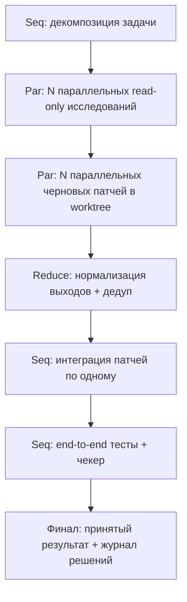

# Последовательная и параллельная оркестрация субагентов в мультиагентных системах

## Контекст и определения

Под «последовательным workflow» здесь подразумевается оркестрация, где один оркестратор вызывает субагентов по шагам, а вход следующего шага зависит от выхода предыдущего (pipeline). Такой режим прямо описывается как *sequential orchestration* в обзоре паттернов оркестрации агентов: выход каждого этапа становится полным контекстом для следующего, что удобно там, где есть строгие зависимости и требуется определённый порядок операций. 

Под «параллельным workflow» имеется в виду *concurrent/parallel orchestration* (fan-out/fan-in, scatter-gather, map-reduce): оркестратор раздаёт подзадачи нескольким субагентам одновременно и затем агрегирует/синтезирует результаты. Этот подход описан в источниках как параллельный запуск независимых «веток» с последующим ожиданием завершения и объединением результата. 

Важное практическое уточнение для вашего CLI-контекста:

- В Codex CLI агент работает локально в выбранной директории и может читать/менять файлы и запускать команды. 
- В Claude Code субагенты — это специализированные агенты с отдельным контекстным окном, собственными ограничениями по инструментам и независимыми permissions; также предусмотрена изоляция через временный git worktree. 
- В OpenCode есть режим «multi-session» (несколько параллельных сессий/агентов на одном проекте) и отдельная система permissions на уровне инструментов (allow/deny/ask). 

Эти свойства среды напрямую влияют на то, *как безопасно параллелить* (особенно, если субагенты способны писать в общий репозиторий) и *какую форму должен иметь contract*.

## Где эффективнее последовательный workflow

Последовательная оркестрация даёт преимущество там, где «выполнить шаг N без результата шага N−1» либо невозможно, либо приводит к лавинообразному росту неопределённости, а значит — к цене ошибок и объёму повторной работы. Это совпадает с рекомендацией: избегать concurrent orchestration, если агенты должны «наращивать» работу друг друга в строгой последовательности, либо нужен детерминированный порядок операций. 

Типовые классы задач, где последовательность обычно эффективнее:

Задачи с сильными зависимостями данных и контекста. Примеры: «спецификация → проектирование → реализация → проверка», «поиск первопричины → воспроизведение → фикс → регрессия». В таких задачах полезно, чтобы следующий агент видел **полный** выход предыдущего шага и не тратил время на догадки. Это ровно логика sequential pipeline, показанная в примере по генерации/проверке контрактов: каждый следующий агент работает уже на “полностью сформированном” артефакте предыдущего этапа. 

Работа с единым изменяемым артефактом, где важен порядок применения изменений. В CLI-агентах таким артефактом часто является дерево исходников. Если два агента параллельно меняют одну и ту же область, стоимость конфликта может превысить выигрыш от параллельности (особенно когда изменения «семантически пересекаются»). В рекомендациях по concurrent orchestration отдельно отмечено: параллельность стоит избегать, если агенты не могут надёжно координировать изменения shared state или внешних систем, либо нет ясной стратегии разрешения конфликтов. 

Детерминированные процедуры и воспроизводимость. Когда результат должен быть «в точности воспроизводимым» (регламентные проверки, комплаенс-процедуры, строго фиксированный порядок шагов), последовательный поток проще тестировать и дебажить; это также подчёркивается как повод избегать concurrent orchestration. 

Интерактивное «reasoning↔acting» с инструментами. Паттерн, когда агент чередует рассуждение и действия (tool calls) для уточнения планов и обработки исключений, концептуально ближе к последовательному циклу. В работе ReAct показано, что «интерливинг» reasoning и действий с внешними источниками помогает снижать галлюцинации и ошибки, возникающие при чисто “внутреннем” рассуждении без проверок. 

Практическая эвристика для CLI: если основной риск — «сделать неправильное изменение в коде», последовательность с явными gate’ами (проверки, тесты, ревью) обычно даёт более высокую надёжность, чем агрессивная параллельность, потому что уменьшает конфликтность и упрощает локализацию причин регресса. И наоборот, если основной риск — «не покрыть все места/варианты», параллельность даёт больший выигрыш (см. следующий раздел). 

## Где эффективнее параллельный workflow

Параллельная оркестрация эффективнее, когда задачу можно разложить на независимые подзадачи или когда выгодно получить несколько независимых «взглядов» на один и тот же вопрос и затем агрегировать результаты (ensemble). Это соответствует описанию concurrent orchestration: независимые агенты работают параллельно, снижая latency и расширяя coverage problem space; затем применяются стратегии объединения — голосование, взвешенное слияние, LLM-синтез, в зависимости от задачи. 

Классы задач, где параллельность особенно сильна:

Fan-out/fan-in подзадачи без строгих зависимостей. В Step Functions Parallel State параллельные «ветки» запускаются максимально одновременно и оркестратор ждёт их завершения перед переходом дальше — это каноническая форма fan-out/fan-in. В агентных паттернах AWS «scatter-gather» описывается как параллельная рассылка задач нескольким исполнителям с последующим объединением/сравнением/выбором. 

Большие партии однотипных работ (map-reduce логика). Для «много элементов → одинаковая обработка → агрегация» удобен map-reduce: MapReduce определяет map как обработку пар key/value с получением промежуточных результатов, а reduce — как слияние по ключу. В workflow-движках аналог — Map State: AWS прямо документирует высокую параллельность (в distributed mode — до 10 000 параллельных child workflow executions; при отсутствии лимита concurrency значение по умолчанию фактически не ограничивает конкуррентность до этого уровня). 

Ensemble reasoning, поиск «устойчивого» ответа при неопределённости. В self-consistency подходе предлагается сэмплировать несколько «путей рассуждений» и затем выбирать наиболее согласованный ответ (мажоритарно/по согласованности); в экспериментах это заметно поднимает качество на задачах рассуждения. Это концептуально параллельный (или квази-параллельный) паттерн: несколько независимых траекторий → агрегация.

Задачи «покрытие пространства решений». Брейншторминг вариантов реализации, поиск мест в кодовой базе, конкурентная генерация альтернативных патчей/тестов, независимая оценка рисков — всё это соответствует «нужно разнообразие инсайтов/подходов» из описания concurrent orchestration. 

Снижение wall-clock latency при независимых tool calls. Если каждый субагент делает I/O-bound операции (поиск по репозиторию, запросы к документации, генерация тестов, запуск независимых наборов тестов), параллельность снижает общий latency, но требует контроля ресурсов и конфликтов (quota, rate limits, блокировки). В Azure guidance прямо отмечено: параллельность полезна в time-sensitive сценариях, но нежелательна при ограничениях ресурсов и отсутствии стратегии разрешения конфликтов. 

В CLI-оркестрации параллельность часто работает лучше всего в «read-mostly фазе» (исследование/поиск/аналитика) и хуже — в «write-heavy фазе» (массовые правки кода). Это согласуется с тем, что в Claude Code встроенный Explore субагент заявлен как read-only и предназначен для быстрого поиска и анализа без изменений файлов. 

## Критерии выбора: как оркестратору решать между sequence, parallel и hybrid

Ниже — практическая схема принятия решения, которую удобно реализовывать прямо в оркестраторе как policy (в том числе в виде скоринга). Она опирается на формальные свойства параллелизма (ограниченность ускорения) и на инженерные ограничения (конфликты shared state, стоимость агрегации, квоты инструментов).

**Критерий зависимостей (DAG/critical path).** 
Если подзадачи образуют цепочку (сильные data-dependencies), параллелизм даёт мало. Если подзадачи независимы (широкий DAG), параллелизм даёт больше. Это базовая логика любого workflow-движка с ветвлениями: Parallel State выполняет ветки «как можно более конкурентно» и синхронизируется перед Next. 

**Оценка «параллелизуемой доли» и ожидаемого ускорения.** 
Даже при бесконечных ресурсах ускорение ограничено последовательной частью. Аmdahl показывает, что общий speedup ограничен долей неизбежно последовательной работы (в классическом параллельном вычислении). Это полезная «проверка здравого смысла» для агентных систем: если 70–80% времени занимает интеграция/ревью/слияние/отладка, агрессивное fan-out даёт небольшой выигрыш и может ухудшить качество. 

**Стоимость агрегации и противоречий.** 
Azure guidance прямо предупреждает: concurrent orchestration стоит избегать, если агрегация слишком сложна или ухудшает качество, либо нет стратегии разрешения конфликтов между результатами. 
Практически: если ответы можно свести голосованием/ранжированием/слиянием по правилам, параллелизм окупается; если требуется долгий «человеческий» разбор, может не окупиться.

**Риск конфликтов shared state.** 
Если субагенты пишут в один и тот же state (файлы в репо, база данных, инфраструктура), риск конфликтов растёт. В Azure guidance это отдельный пункт «When to avoid concurrent orchestration». 
Для CLI-агентов хороший индикатор риска — ожидаемое пересечение по файлам/директориям/ownership.

**Требования к воспроизводимости и аудиту.** 
Если нужен воспроизводимый порядок шагов и прозрачная трассировка зависимостей, последовательный pipeline проще. Это также следует из рекомендаций избегать parallel, когда нужен строгий порядок. 
(Параллельность можно сохранить на уровне «read-only анализа», оставив последовательной фазу «apply & finalize».)

**Ограничения ресурсов и квот.** 
Параллельность упирается в квоты модели/инструментов/инфраструктуры. В Step Functions есть явные concurrency параметры и/или системные лимиты; документация подчёркивает необходимость задавать concurrency и учитывать downstream ограничения (например, child workflows). 

**Уровень неопределённости задачи.** 
Когда неизвестно, «какой подход верный», выгодно параллелить именно **варианты** (alternative proposals), а затем сводить результат через арбитраж. Это формализуется как ensemble reasoning/голосование/LLM-merge в Azure guidance, и как self-consistency в академической работе. 

**Рекомендуемая базовая политика (почти всегда работает в engineering-задачах): hybrid.** 
1) короткая последовательная фаза планирования/разбиения; 2) параллельная read-mostly фаза (поиск/анализ/генерация альтернатив/черновиков тестов); 3) последовательная фаза интеграции/применения изменений/проверки. Эту композицию можно рассматривать как частный случай map-reduce: «map = независимый анализ», «reduce = интеграция + арбитраж». 

## Делегирование, delegation contract, shared state и агрегация результатов

Ниже — практические правила для оркестратора, сформулированные так, чтобы их можно было внедрять поверх Codex CLI / OpenCode / Claude Code, где агенты умеют читать/писать файлы и запускать команды. 

**Делегирование при последовательном управлении субагентами (отдельный параграф).** 
Оркестратор должен выдавать задания как «шаги pipeline» с жёсткой фиксацией входа/выхода каждого шага и с gate’ами между шагами. Практика из durable-execution систем полезна как ментальная модель: оркестратор отвечает за детерминированную оркестрацию и проверяемые переходы, а «побочные эффекты» (изменение файлов, вызовы внешних систем) должны быть упакованы в изолируемые операции, рассчитанные на повторы. В Temporal подчёркивается: код workflow должен быть детерминированным (для replay), а Activities нужно проектировать идемпотентными, потому что они могут выполняться более одного раза при retries. 
В CLI-реализации это превращается в правило: *каждый шаг либо оставляет репозиторий в валидном/проверяемом состоянии, либо откатывается*. Для Claude Code полезен встроенный механизм checkpointing: он фиксирует состояние перед каждым изменением, позволяет «restore code and conversation» и поддерживает rewind; при этом документация отдельно отмечает ограничения (изменения через bash не отслеживаются; внешние/конкурентные правки отслеживаются ограниченно). 
Из этого следует конкретная тактика: после каждого write-heavy шага — обязательный «verification step» (тесты/линт/статическая проверка), а затем только переход к следующему шагу; при провале — rewind/rollback и повтор с уточнёнными ограничениями.

**Делегирование при параллельном управлении субагентами (отдельный параграф).** 
Оркестратор обязан проектировать параллельные подзадачи так, чтобы минимизировать shared-state write conflicts и упростить fan-in. Это совпадает с предупреждением Azure: параллельность не подходит, если агенты не могут координировать изменения shared state или нет стратегии конфликт-резолюшена. 
Самый устойчивый приём для CLI: параллелить **read-only анализ** и/или **изолированные изменения**. В Claude Code субагент может быть запущен в изоляции `worktree`, то есть работать в отдельной копии репозитория и затем возвращать патч/дифф (идеально для параллельных «черновиков»). В OpenCode доступ к инструментам может быть ограничен на уровне permissions (например, deny edit/write или ask на bash), что позволяет запускать параллельные исследовательские агенты без права «ломать» репозиторий. 
При fan-in оркестратор должен явно выбирать стратегию: «ожидать всех» (barrier) как в Parallel State, либо принимать частичные результаты по таймауту и продолжать (partial gather). Step Functions Parallel State — пример строгого barrier: Next исполняется только после завершения всех веток. 

### Как строить delegation contract

Надёжный delegation contract в мультиагентной системе лучше рассматривать как сочетание: (а) **схемы данных**, (б) **критериев завершения**, (в) **протокола ошибок/повторов**, (г) **политики побочных эффектов**. Такой подход согласуется с практиками workflow-движков, где предусмотрены retries/catch и формализованная обработка ошибок. 

Ниже — рекомендуемый состав контракта (в скобках — почему это важно и на что опирается):

**Input schema.** 
Структурируйте вход как JSON-объект с обязательными полями: `task_id`, `goal`, `context_refs`, `allowed_paths`, `forbidden_paths`, `time_budget`, `tools_allowed`, `tools_denied`, `expected_artifacts`. Смысл `allowed_paths` хорошо согласуется с тем, что CLI-агент действует в выбранной директории/рабочих директориях (пример: Codex CLI работает в selected directory; Claude Code поддерживает добавление working directories). 

**Output schema.** 
Разделяйте: (1) *результат* (patch/дифф, список файлов, отчёт), (2) *доказательства* (команды, вывод тестов, ссылки на найденные места), (3) *метаданные* (confidence, риски, ограничения). Такой формат облегчает последующий «reduce» и арбитраж (Azure рекомендует выбирать стратегию агрегации под тип задачи). 

**Definition of done.** 
Формализуйте DoD как проверяемые условия: «все тесты N прошли», «линтер без ошибок», «не изменены запрещённые файлы», «покрыты пути X/Y». В Step Functions и Temporal ключевой смысл оркестратора — довести процесс до терминального состояния с заданной политикой ошибок/повторов; DoD — это локальная версия «terminal state». 

**Constraints.** 
Включайте ограничения на инструменты, сеть, команды, каталоги. В OpenCode это поддерживается через permissions на инструменты (allow/deny/ask). В Claude Code субагенты имеют отдельные tool restrictions и permission modes. 

**Confidence и калибровка.** 
Требуйте от субагента не «общий confidence», а разложение: `confidence_core_changes`, `confidence_tests`, `unknowns`. Для конкурирующих ответов это позволит делать осмысленное взвешивание при merge (Azure прямо перечисляет weighted merging как один из методов). 

**Error/status reporting.** 
Минимальный протокол должен включать: `status` (success/partial/fail), `error_class` (retriable/non_retriable), `root_cause_hypothesis`, `next_action_suggestion`. Это соответствует тому, что в workflow-системах важно разделять retriable ошибки и терминальные, а также иметь structured error handling (AWS Step Functions: retry/catch; Temporal: retry policies). 

**Retries, backoff, idempotency.** 
Если оркестратор допускает повторы шага (а в распределённых системах повторы неизбежны), контракт должен требовать идемпотентности или идемпотентных ключей. Temporal прямо рекомендует делать Activities идемпотентными, поскольку они могут выполняться более одного раза. 
Формальное определение идемпотентности широко фиксируется и в HTTP-стандартах: RFC 9110 определяет идемпотентные методы как такие, где повторные идентичные запросы имеют тот же эффект, что и один запрос. 
Для небезопасных операций (например, запись через POST/PATCH в внешнюю систему) существует стандарт-трек IETF draft для заголовка Idempotency-Key, который делает такие запросы устойчивыми к повторам при сбоях. 
Перенос в CLI: каждый write-heavy шаг должен иметь «ключ операции» (`task_id` + hash входа) и уметь безопасно переисполняться (например, повторное применение патча не ломает репо, повторный запуск миграции не создаёт дубликаты).

**Tool permissions.** 
Контракт должен перечислять инструменты и режим разрешений (auto/ask/deny). В OpenCode это конфигурируется на уровне tools через permission field. В Claude Code tool access задаётся в subagent config; также есть hooks на PermissionRequest/PreToolUse, которые позволяют централизованно решать «разрешить/заблокировать» действие. 

**Versioning.** 
Контракт стоит версионировать: `contract_version`, `agent_version`, `toolchain_version`. Идея safety при изменениях workflow-кода хорошо отражена в Temporal: изменения Workflow code требуют осторожности из‑за детерминизма; используются механизмы versioning/patching. 
Для CLI-оркестратора это практический аргумент: изменение формата артефактов/статусов без версий ломает агрегацию и ретраи.

### Как предотвращать конфликты и управлять shared state

Главная причина, почему параллельные агенты «ломают» инженерные процессы, — неконтролируемые конфликты вокруг shared state. Это прямо выделено как условие, при котором concurrent orchestration следует избегать. 

Надёжные стратегии (в порядке практической применимости к CLI):

**Разделение на read-only и write зоны.** 
Параллелить исследование и генерацию планов (read-only), а запись выполнять последовательно маленькими атомарными шагами. В Claude Code встроенный Explore субагент именно read-only и предназначен для поиска/аналитики без изменений, что делает его естественным кандидатом для параллельной «разведки». 

**Изоляция изменений через worktree/ветки.** 
Запускайте параллельных «пишущих» агентов только в изоляции (worktree/branch), а затем сводите патчи centrally. Claude Code поддерживает `isolation: worktree` для субагентов. 

**Локинг и ownership.** 
Оркестратор вводит «право владения» файлами/модулями на время операции: агент получает lease на набор путей; другие агенты либо не пишут туда, либо пишут только через согласованный merge. Это соответствует общим принципам координации shared state в распределённых системах: либо координация (locks), либо проектирование структуры данных так, чтобы конфликты автоматически сходились (см. CRDT ниже). 

**CRDT-подход для отдельных типов общего состояния.** 
Если shared state — не код, а «накапливаемые результаты» (списки найденных мест, метрики, статусы), можно использовать conflict-free replicated data types: CRDT гарантируют сходимость реплик без координации при наличии корректных merge-правил (commutative/associative/idempotent merge для state-based подхода). 
Практически: результаты анализа лучше хранить как множества/счётчики/регистры с явными merge-правилами, а не как «один общий файл, куда все пишут произвольно».

**Явная модель побочных эффектов + компенсирующие действия (Saga).** 
Если агенты трогают внешние системы (создают тикеты, ресурсы, записи), полезна дисциплина Saga: транзакция представляется как последовательность локальных шагов с компенсирующими транзакциями при сбое. Это позволяет «собрать» систему обратно в консистентное состояние без 2PC. 

### Как делать aggregation/merge/arbitration результатов

Агрегация — это «reduce» стадия параллельной оркестрации, и именно она часто определяет качество системы. Azure guidance даёт прямые примеры стратегий: majority voting для классификации, weighted merging для ранжированных рекомендаций, LLM-synthesized summary для согласования в нарратив. Ниже — прагматичный набор методов для агентных CLI-пайплайнов:

**Merge по «типу артефакта», а не по тексту.** 
Если выход — патч, то merge должен происходить на уровне диффов/файлов, а не «LLM склеил описание». Если выход — список фактов/находок — merge как set-union с дедупликацией и источниками. MapReduce формализует идею: reduce — это *слияние* всех значений по ключу. 

**Арбитраж через self-consistency/голосование.** 
Когда выход — «ответ/решение» (например, классификация проблемы, выбор подхода), используйте несколько независимых предложений и затем выбирайте наиболее согласованное. Это прямо соответствует self-consistency (несколько reasoning paths → наиболее согласованный ответ) и рекомендации Azure про voting/quorum. 

**Maker-checker в качестве reduce.** 
Даже в параллельном пайплайне полезно иметь финальный «checker» (ревьюер/валидатор), который принимает или отклоняет результат по DoD, а при отклонении формирует конкретные замечания. Azure отдельно описывает maker-checker loop как частный случай orchestration с критериями завершения и лимитом итераций. 

**Доказательства первичнее «красивого текста».** 
В CLI-задачах лучше считать «истиной» результаты инструментов: успешный прогон тестов, вывод линтера, диффы. В Claude Code есть hooks, которые могут запускаться после tool calls и в ключевые моменты жизненного цикла; это позволяет автоматизировать проверки (например, «после изменения файлов запусти тесты»), а также блокировать опасные операции до выполнения условий. 

## Эталонные workflow-схемы

Ниже — 3 схемы (sequence / parallel / hybrid), адаптированные под CLI-агентов, где субагенты могут читать/писать файлы и запускать команды. Логика схем опирается на описанные паттерны sequential и concurrent orchestration, fan-out/fan-in и map-reduce. 

```mermaid
flowchart TD
 A[Оркестратор: цель + ограничения] --> B[Агент 1: разведка/контекст (read-only)]
 B --> C[Gate: план + критерии DoD]
 C --> D[Агент 2: реализация изменений (write)]
 D --> E[Gate: тесты/линт/сборка]
 E --> F[Агент 3: ревью/риски (read-only)]
 F --> G[Gate: принятие/правки/rollback]
 G --> H[Финал: PR/патч + отчёт]
```

```mermaid
flowchart TD
 A[Оркестратор: постановка + contract] --> B{Fan-out}
 B --> C1[Субагент A: поиск по коду (read-only)]
 B --> C2[Субагент B: генерация тестов (изоляция)]
 B --> C3[Субагент C: альтернативный фикс (изоляция)]
 C1 --> D[Fan-in: сбор артефактов]
 C2 --> D
 C3 --> D
 D --> E[Arbitration: merge/vote/check]
 E --> F[Apply: последовательное внесение/слияние]
 F --> G[Verify: тесты]
 G --> H[Финал]
```



Эти схемы intentionally «гибридные по умолчанию»: параллельность используется там, где она даёт coverage и ускорение (исследование, варианты), а запись в shared state и финальная валидация остаются последовательными, чтобы минимизировать конфликты и сделать процесс воспроизводимым. Это следует из условий «когда использовать/когда избегать» concurrent orchestration и из того, что fan-out/fan-in требует ясной стратегии агрегации и контроля shared state. 